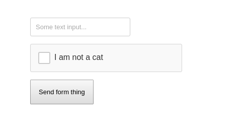

# ReCATcha

The latest and greatest in feline-focused spam reduction. Future-proof web-scale enterprise cat detection, built for [Stupid hackathon Stockholm 2017](https://www.stupidhackathon.se/). Never ever run this in production. Or anywhere, really.



## Installation
The ReCATcha project is split into three major components, making the installation as easy as one-two-three.
### The ReCATcha cat-detection server
The ReCATcha cat-detection server is a python script running a TCP listener on an arbitrary port, expecting a huge base64-encoded payload containing image data for processing. It uses the fantastic OpenCV project, combined with a pre-made cat-focused training set supplied by Joseph Howse, in order to make a somewhat working approximation on whether or not the supplied image data contains a cat in it. 
```
$ cd server && virtualenv venv && source venv/bin/activate
(venv) $ pip install -r requirements.txt
(venv) $ python server.py 8899 (or port of your choosing)
```
### The ReCATcha PHP SDK for your enterprise web-app integrations
The PHP SDK provides a small client for easy communications with the cat-detection server. Simply instantiate the client with the address and port of your cat-detection server, and start sending it your image data. NOTE: The SDK uses the php sockets extension. Make sure it is enabled/installed on your machine before attempting to run it.
```
<?php
$server_addr = "127.0.0.1";
$server_port = 8899;
$data = {{your base64-encoded image data}}

require_once "php-sdk/recatcha_sdk.php";
$recatcha_client = new Recatcha\MuchEnterprise\SDK\RecatchaClient($server_addr, $server_port);
$response = $recatcha_client->send($data);
```
### The ReCATcha javascript browser client
The javascript browser client provides an easy way to quickly add the ReCATcha functionality to your forms. Simply include the `<div id="recatcha"></div>` element within your HTML form, instantiate the client with a simple options object and the rest will handle itself automatically! Note: Currently only Chrome is supported. For in-depth, working examples, please have a look in the `/example` folder. The quickest way to get a demo going is running the python server above in one terminal (at port 8899) and then use the PHP dev-server to fire up the example page:
```
$ cd example && php -S localhost:8888
```
Then simply visit http://localhost:8888/ in Chrome.
